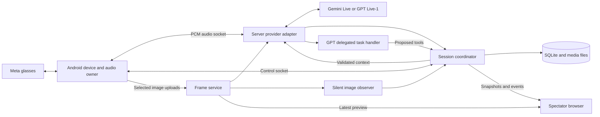

# Wearable coach architecture

Implementation now exists. See [the runnable prototype and verified limits](../README.md); this document preserves the design plan.

September 15, 2026. Planning only; no application components are implemented. Developed through independent proposals and reciprocal review with Claude Fable 5.1. See [review decisions](design-review.md).

## Scope and decisions

Build the wearable conversation pipeline before selecting an exercise. The learner uses Meta Ray-Ban Display through an Android phone. A separate browser shows the camera preview, captions, desired HUD, actual device status, and diagnostics. One model speaks. Choose `gemini-3.8-live` or `gpt-live-1` before starting a session.

| Decision | Reason |
| --- | --- |
| Kotlin/Compose Android, TypeScript Node server, React spectator | Keep device APIs native and share control contracts between server and browser. |
| One server process, one SQLite database, local media files | State, accepted commands, and their evidence can commit together. No distributed services or database server. |
| Relay media through the backend for the first working loop | Implement provider protocols once, retain server ownership of tools, and inspect the same path for both providers. Measure the added hop. |
| Separate audio, control, and image transfer | An image upload or slow spectator must not queue ahead of microphone audio or a stop command. |
| Full HUD replacement with a revision | Retrying a desired state is simpler than replaying imperative display operations. |
| Separate connection, microphone, playback, and work states | Listening, speaking, and delegated work can overlap. |
| Preserve original evidence; derive captions and summaries | Provider transcripts, learner claims, observer conclusions, and confirmed actions have different meanings. |

SQLite replaces the handoff's optional JSONL storage recommendation. Keep JSONL as an export format. The benefit is a transaction covering deduplication, HUD mutation, and event append; a JSONL implementation would need to solve those crash boundaries itself.

## System map

The observer and delegated task handler are server modules, not services. They may use the same ordinary multimodal model initially, with separate prompts and request records. The observer describes images. The task handler reconstructs delegated requests and proposes allowed tools. Neither speaks directly.

## Ownership and module boundaries

| Owner | Responsibilities | Must not assume |
| --- | --- | --- |
| Android device bridge | Registration, camera, HUD primitives, permissions, capability reporting, mock/phone alternatives | DAT access proves simultaneous camera/audio/display support. |
| Android audio engine | Sole capture/playback owner, routing, resampling, bounded queues, immediate mute/stop, playback telemetry | Enqueued audio was heard; selected glasses route is still active. |
| Android session controller | Start/end, current server lease, reconnect, local stop latch, accepted HUD cache | A disconnected cached HUD is current or a new socket restores model memory. |
| Server session coordinator | Serialized state mutations, command deduplication, work validity, HUD revisions, event sequencing | Model output or client-provided revision numbers are trusted commands. |
| Provider adapters | Exact vendor protocol, capability negotiation, tool/delegation mapping, usage, session recovery | Every provider has turns, cancel acknowledgments, or image input. |
| Frame/observer modules | Explicit frame capture requests, freshness, selected uploads, observations and provenance | The latest received image is the latest captured image. |
| Spectator | Read-only projections, replay cursor, frame age, render evidence, metrics | Captions equal audible speech, or desired HUD equals glasses output. |

Suggested folders: `android/`, `server/src/{sessions,providers,tools,media,storage}/`, `web/`, `contracts/`, `fixtures/`, `docs/`. Keep classes/packages small; no cross-language SDK generator or plugin framework initially. Implement shared JSON Schema validators in TypeScript and matching Kotlin DTOs, checked against the same fixtures.

## Session lifecycle

1. An authenticated phone creates a session with an idempotent creation request and immutable provider/model/configuration. The server returns a session ID and current connection generation.
2. Android reports actual device capabilities and audio routes. The server checks provider access and returns the resolved audio format. Unconfigured GPT is visibly unavailable.
3. Open the control channel, then bind audio to the issued generation. The coordinator starts the selected adapter. Only after provider readiness may capture flow into it.
4. Capture and playback run independently. HUD/tool requests go through the coordinator. Snapshot/event fan-out never blocks media delivery.
5. On disconnect, mute playback immediately and discard queued media. Reconnect requires a newly issued generation, current state snapshot, and newly bound media channels. Do not replay buffered microphone speech.
6. On stop, fence work and audio immediately, clear local output, and reject new actions. Drain provider finalization up to a configured timeout; record incomplete final usage when necessary.
7. A provider change ends the application session and creates another. A later continuation feature may seed explicit history; no hidden-state transfer is promised.

Generation is a server-issued lease for the active phone/provider media binding. Replacing either deliberately fences both, cancels pending work, and rebinds/reopens or resumes the provider under a new generation. This conservative coupling costs reconnect time but simplifies the initial relay. Spectator reconnects do not change it. A server crash ends active sessions as `interrupted`; restart does not silently revive them or rerun work. An optional subsequent session may refer to the interrupted session.

Keep status axes independent: lifecycle `starting | active | reconnecting | ending | ended | failed | interrupted`; microphone `muted | capturing | unavailable`; playback `idle | playing | suppressed | unavailable`; provider work `idle | busy | unknown`. Hardware reports can lag and carry their own timestamps.

## Provider differences that stay inside adapters

### Gemini

Use standard `gemini-3.8-live` first. Native image input supports the explicit inspect workflow. Initial audio is PCM16 mono at 16 kHz input and 24 kHz output; model video sampling is limited to one image per second. Keep format conversion explicit. [Capabilities](https://ai.google.dev/gemini-api/docs/live-api/capabilities)

Enable context compression and resumption from the first sustained-session milestone. Resumption handles are secrets held in server memory; if recovery fails, record a fresh provider conversation and seed approved application history. [Session management](https://ai.google.dev/gemini-api/docs/live-api/session-management)

The existing research proved simple synthetic frame/question tests and explicit activity boundaries, but not real-device automatic turn detection or post-interruption recovery. Preserve a manual-boundary debugging option. Do not use that result to advertise hands-free reliability. See [local measurements](../model-research/gemini38/analysis.md).

Extended Thinking is optional later. Its utterance completion and background interaction completion differ, so adapter work state must remain independent of audio state. [Thinking lifecycle](https://ai.google.dev/gemini-api/docs/live-api/thinking)

### GPT Live-1

Use the Live API and exact `gpt-live-1` model. It accepts audio/text, so vision requires an ordinary multimodal observer. [Model](https://developers.openai.com/api/docs/models/gpt-live-1)

Use client delegation. The event supplies an ID and timeline position, not a task body. Snapshot transcript fragments and application state at delegation, then ask a bounded task handler to propose `set_hud`, `clear_hud`, or `inspect_frame`; validate every proposal. Record the derived request as an inference and retain its input fragments/offset. Missing or ambiguous request context yields clarification, never a guessed action. Use a separately configurable ordinary model for this handler, with one bounded follow-up for an inspect result. [Delegation](https://developers.openai.com/api/docs/guides/live-delegation)

Send observer results as factual, attributed context through `session.thinking.append`; reserve commentary for intended spoken results. An append acknowledgment does not prove uptake. Preserve context-delivery status separately from observations. [Context](https://developers.openai.com/api/docs/guides/live-conversations)

For the relay baseline, choose PCM16 mono at 24 kHz in both directions. Keep capture continuous and paced, including silence; do not borrow Realtime input-commit or voice-response commands. Output audio lacks authoritative turn completion, so an application playback queue supplies delivery telemetry. [Live WebSocket protocol](https://developers.openai.com/api/docs/guides/voice-websockets?api=live)

### Transport evolution

After the relay loop passes hardware tests, measure Gemini direct mobile WebSocket with backend-issued ephemeral tokens and GPT WebRTC with server control. Google's token guide now documents Gemini 3.8 and `v1beta`; that path still needs account testing. Do not implement both transports in the first slice. [Ephemeral tokens](https://ai.google.dev/gemini-api/docs/live-api/ephemeral-tokens)

The stable interface is lifecycle, audio binding, typed context, inspect capability, tool results, and normalized events. Audio binding is either relay PCM or a future direct-media handle; device/HUD/session code must not require a backend PCM socket. Capabilities report visual input, turn-control mode, tool model, output-stop strategy, recovery mode, and negotiated audio format.

## Failure rules

### Commands and slow work

Route state changes through one per-session serialized coordinator. No network/model/file operation runs inside its transaction. Reserve work, execute asynchronously, then re-enter with its original session, generation, work ID, deadline, and expected HUD revision. Commit only if all applicable guards still hold. A caption or diagnostic event does not invalidate unrelated work.

Duplicate command ID with identical input returns the recorded outcome. Different input with that ID is a conflict. A timed-out request is not necessarily an unexecuted request. Record dropped/obsolete outcomes for diagnosis without applying them. The first prototype only exposes reversible HUD state and read-only inspection.

### Interruption and audio

Distinguish `stop_speech` from `cancel_work(workId)` and session end. Android first latches suppression and flushes playback locally, then informs the server. Old connection audio is rejected at adapter callback, relay, and player boundaries. Mute capture separately.

Track a separate server-issued `speechEpoch` for playback flushes. Where a provider exposes an interruption signal, relay it as a flush and reject buffered audio from earlier epochs. If new-epoch audio outruns the control message on the separate socket, withhold/drop it until the control barrier is applied. Changing this epoch never cancels work. Do not invent an interruption signal for a provider that does not expose one.

A new application output epoch cannot identify old GPT audio arriving later on the same provider stream. Do not relabel those chunks as fresh. Keep output suppressed until a provider-specific, tested recovery boundary; the conservative explicit-stop fallback replaces the provider connection and seeds history. With the joint lease, this fallback also cancels pending work and rebinds phone media; measure that cost early. Speech suppression itself does not require cancelling work, but this recovery strategy does. Natural full-duplex interruptions use the provider behavior without a blanket microphone-driven mute. Prompting the model to stop is not a deterministic playback barrier. [Playback control](https://developers.openai.com/api/docs/guides/voice-server-controls?api=live)

### Current frames and stale observations

`inspect_frame` creates a request ID and captures a new image after the request. Bind question, work, and exact frame IDs. If camera access fails or freshness cannot be established, report that fact; never quietly use the old preview. A frame of unknown capture age can be discussed only as the last frame received, with that limitation stated. It cannot pass the current-view acceptance gate.

Both real providers use the structured observer for explicitly requested inspection frames. Gemini inspection tools block until the server returns the complete observation; GPT receives the observation as attributed context before its spoken instruction. Direct image input remains an adapter capability used by protocol fixtures, but the application inspection path uses the observer. Record inference, dispatch, acknowledgment where supported, and the eventual response as different evidence.

An observation for a previous request or expired frame can remain historical evidence but cannot become current guidance. Background preview uses a newest-frame slot; explicit inspection uses a separately pinned frame so routine sampling cannot replace it. Re-check relevance at tool commit and context injection, not only when the observer starts.

### HUD and reconnect

The server owns desired HUD content and `hudRevision`. Android applies only newer revisions for its current session/generation. A device reconnect re-renders the current snapshot with a new renderer-instance ID. Receipts identify target (`glasses | phone | mock`), revision, instance, and strength of evidence (`phone_received | sdk_submitted | sdk_confirmed | failed | unsupported`). Never label an SDK submission as pixels seen by the learner.

Assign event sequences inside the committing transaction and publish in commit order. For spectator catch-up, register the subscriber/buffer before reading the snapshot at sequence S, then drain only events greater than S. Ignore duplicates, detect gaps, and resnapshot if a cursor is expired or a buffer overflows. Event replay updates views only; it cannot invoke tools, timers, models, or audio playback.

## Media budgets and timing

Initial tunable budgets: 20 ms audio packets, at most 250 ms pending input and 500 ms pending playback, one latest preview frame, one pinned inspection frame, and one active observer request plus one pending replacement. Validate these on hardware; they are application defaults, not vendor limits. Sustained audio overflow forces an explicit discontinuity/reconnect rather than replaying old speech. Bound WebSocket send buffers as well as application queues.

Upload selected JPEGs separately with a byte-size limit. Start spectator preview at at most one frame per second; mark it as sampled and show capture age. Add a higher-rate feed only after the core loop works. Keep projector audio off initially.

Record wall time for human-readable logs and monotonic time with a clock-instance ID for durations. Estimate phone/server offset with ping exchanges and preserve uncertainty. Also verify the SDK's camera timestamp: glasses-to-phone buffering is a separate uncertainty, and phone receipt time is not capture time. Freshness decisions use an upper bound on capture age; unknown capture time is not a fresh frame. Playback timestamps are device estimates until verified acoustically. Never subtract unsynchronized host timestamps to publish a latency number.

## Evidence, storage, and access

See [schema](schema.md) for durable records and wire messages. Store transcript fragments, selected frame metadata, observations, tool proposals/outcomes, render receipts, configuration/prompt versions, usage, timing, and explicit missing-data markers. Preserve evidence IDs for a later independent evaluator; do not add curriculum, scores, retrieval, or evaluation tables yet.

Default proposal: retain local session metadata/transcripts for 24 hours; camera preview bytes remain transient. A visible evidence-recording option retains selected inspection images for the same period. Raw audio recording is off. Explicit export may retain selected evidence longer and states what was omitted. Record deletion/expiry in asset metadata while the session remains; deleting a whole session removes its related rows and files. Provider-side retention must be configured and documented separately.

Backend keys, temporary tokens, signed URLs, and resumption handles never enter events or exports. Use an allowlist when recording provider diagnostics. Authenticate the phone with a provisioned development credential over TLS; issue session-scoped operator and read-only spectator capabilities. Bind authenticated control/media/upload paths to the same session and current lease. Spectator tokens cannot operate devices, create sessions, or invoke models. Bind to localhost by default; phone access requires explicit LAN/TLS setup. Do not create public camera links.

## Build order and acceptance gates

| Slice | Deliverable | Gate |
| --- | --- | --- |
| 1 | Contracts, coordinator, SQLite, mock phone/HUD, spectator snapshot | Duplicate tools apply once; stale work and replay cannot cause side effects; crash leaves honest state. |
| 2 | Android hardware test screen and native renderer | Test camera + microphone + speaker + display together; document actual routes and SDK receipt semantics. |
| 3 | Gemini relay conversation and explicit inspect | Grounded answer + accepted HUD + render evidence; audible interruption and useful recovery, not cancellation alone. |
| 4 | GPT Live-1, observer, delegated task handler | Same controls and inspect flow; overlap/transcript tests; unconfigured access remains explicit. |
| 5 | Recovery, evidence export, comparison | Real five-minute sessions, forced provider recovery, screen-off behavior, clocks, bounded queues, observer-inclusive cost. |

Check direct OpenAI access and Android/Meta prerequisites early during implementation. They block their live acceptance gates, not schema or mock development. Meta's repository currently publishes DAT 0.9.0 with camera/display/mock modules, but only real hardware tests establish supported combinations and Neural Band input. [Official Android repository](https://github.com/facebook/meta-wearables-dat-android)

Open decisions that require testing: actual hardware/firmware and permissions; reliable audio route and echo behavior; GPT account access; observer/handler model quality; relay latency; provider-specific stop/recovery behavior. None require choosing a training scenario first.
