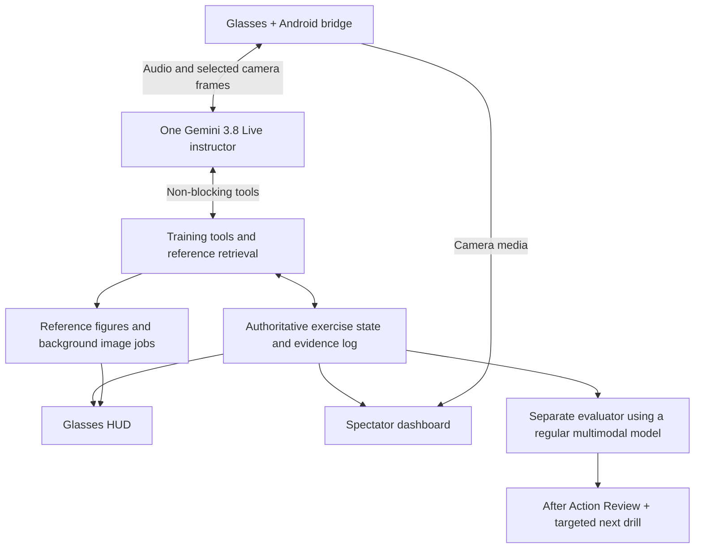

# Gemini 3.8 Live and Extended Thinking: training-coach assessment

Researched and tested September 15, 2026, their release day.

## Decision

**Move Gemini 3.8 Live to the front of the prototype shortlist. Keep Extended Thinking as the alternative for more demanding conversational reasoning.** Both can receive camera input directly, and the new asynchronous tools remove a major limitation of Gemini 3.1 Live. This makes a single multimodal instructor more attractive than the separate voice/observer architecture proposed earlier.

In the small tests here, Standard Live gave correct rubric judgments faster. Extended Thinking demonstrated useful spoken acknowledgment while a tool result was pending, but took longer to finish. The tests do not establish better visual accuracy or better training outcomes for Extended Thinking.

The audio-input and interruption path needs further validation before a stage commitment. Both models completed a synthetic speech-plus-image test with explicit activity boundaries and a clearer speech fixture. Automatic turn detection and recovery after interruption remained unresolved in this harness. None of these tests exercised the actual glasses audio route.

## What is confirmed today

Google's September 15 changelog identifies both models as generally available. The model IDs are `gemini-3.8-live` and `gemini-3.8-live-extended-thinking`. This supersedes the earlier report's uncertainty about their public documentation. [Release notes](https://ai.google.dev/gemini-api/docs/changelog).

Both accept audio, images, video and text; the published limits are 131,072 input tokens and 65,536 output tokens. The model card says they are based on Gemini 3 Pro and gives a January 2025 knowledge cutoff. Training material should therefore be supplied explicitly. The older version string seen in catalog metadata does not establish that these are merely aliases for the old Live model. [Model card](https://deepmind.google/models/model-cards/gemini-3-8-audio/).

### Differences that affect the application

| Concern | Gemini 3.8 Live | Extended Thinking |
|---|---|---|
| Reasoning | Interleaved; no configurable thinking level | Background reasoning; Low, Medium or High |
| Main fit | Quick dialogue and direct coaching | Complex explanations and multi-step workflows |
| Tool execution | Non-blocking by default; blocking remains available | Non-blocking only |
| Tool-result scheduling | Silent, when idle or interruption scheduling supported | Scheduling controls not supported |
| Spoken progress | Do not assume it will acknowledge every slow task | Designed to give intermediate spoken updates |
| End of speech | Conventional turn lifecycle | May still be reasoning or waiting for a tool |
| Proactive audio | Permanently enabled | Permanently enabled |
| Structured output schema | Not supported | Not supported |

Sources: [Standard model](https://ai.google.dev/gemini-api/docs/models/gemini-3.8-live), [Extended model](https://ai.google.dev/gemini-api/docs/models/gemini-3.8-live-extended-thinking), [thinking guide](https://ai.google.dev/gemini-api/docs/live-api/thinking).

“Extended Thinking” should not be implemented as “wait for one longer answer.” A single request can produce an acknowledgment, background work and a later answer. It also does not mean the application should show private reasoning; the useful user-facing material is concise progress and the eventual explanation.

## Published performance: promising, with limits

Google reports an Artificial Analysis Speech-to-Speech Index score of 82.6 and first place for Extended Thinking, 97.7% on Big Bench Audio, 68.6% on tau-Voice, and 35.1% on tau-Voice banking. It reports second place in Speech Agent Arena for Standard Live. Google also advertises automatic switching among 97 languages. These are launch claims, not results reproduced here. [Google announcement](https://blog.google/innovation-and-ai/models-and-research/gemini-models/gemini-3-8-live-gemini-3-8-live-extended-thinking/).

Artificial Analysis explains that its index combines speech reasoning, agentic performance, arena preference and task success. Big Bench Audio uses spoken reasoning questions; tau-Voice uses customer-service workflows. Those tests support taking the models seriously, but do not measure first-person medical technique, camera occlusion, pressure assessment or the quality of an After Action Review. [Benchmark methodology](https://artificialanalysis.ai/speech-to-speech?api-benchmarks=agentic-performance-vs-cost-to-run).

## Our tests

Requests went directly to Google's Live WebSocket API, using the supplied Gemini key. The harness used `v1alpha`, as shown in the new thinking guide, and recorded sanitized events. Most comparison turns used the same Puck voice. Low/High were explicitly configured for Extended Thinking; Standard used its default configuration.

These are engineering smoke tests with very small samples, not a standardized model benchmark. They used artificial diagrams and synthetic speech, not real people, medical equipment or Meta hardware. Turn-completion timings describe server events; no speaker playback was timed. First-audio latency can measure an acknowledgment rather than the substantive answer.

### Repeated short turns

Prompt: say only “Ready when you are.” Three fresh sessions per model.

| Metric | Standard | Extended Low |
|---|---:|---:|
| Median first audio | 656 ms | 611 ms |
| Observed first-audio range | 637–810 ms | 592–738 ms |
| Median server turn completion | 1,887 ms | 1,789 ms |

Both returned the requested phrase in all three trials. The small difference is insufficient to claim either is faster. It does show that Extended Thinking need not impose a large delay on a trivial request.

### Rubric reasoning

An artificial procedure required inspection before attachment, attachment before testing, and a repeated inspection and test after repositioning. The supplied log omitted inspection after repositioning. It also lacked a force sensor. The model had to reject the success claim, identify the missing inspection, and decline to assess pressure adequacy.

Each configuration returned all three required conclusions in both trials.

| Metric, two trials each | Standard | Extended Low | Extended High |
|---|---:|---:|---:|
| Median first audio | 1.14 s | 3.73 s | 0.99 s |
| Median first verdict transcript received | 1.34 s | 4.42 s | 6.84 s |
| Median server completion | 9.39 s | 13.00 s | 14.36 s |

High began with a short acknowledgment before the verdict. Its quick first audio did not mean it solved the task earlier. Standard was the better fit for this particular direct rubric check. This task was too easy and too small to establish the value of deeper reasoning on difficult tutoring conversations. Medium was not quality-tested.

### Visual grounding and frame timing

Three deliberately simple diagrams showed a blue strap in zone A, then B, then hidden behind an opaque cover. Labels and colors were clear, with no clinical interpretation needed.

The first delivery method sent a realtime video frame, waited 150 ms, then sent a separate completed text turn. Standard answered all three incorrectly; Extended answered the first incorrectly and the next two correctly. Some usage events did not yet show image tokens. That is consistent with a synchronization problem, but does not prove the exact internal cause.

Two follow-up delivery methods were successful:

1. **Image and question in the same client message:** both models answered all three correctly.
2. **Realtime frames with time to ingest:** send the same frame twice, 1.1 seconds apart, wait another 1.1 seconds, then use realtime text. Both models again answered all three correctly.

For the first method, median first audio was 717 ms for Standard and 1,390 ms for Extended Low. For the second, it was 712 ms and 705 ms, measured after the question; those numbers exclude the deliberate 2.2-second frame-ingestion interval.

**Consequence:** pair the relevant current frame with an important assessment request. Do not assume the newest frame has been consumed merely because the phone transmitted it. The API reference explicitly warns that mixing client-content and realtime-input messages does not guarantee ordering. [Live protocol](https://ai.google.dev/api/live).

These simple diagrams establish basic perception and uncertainty behavior under controlled delivery. They do not validate real hands, motion blur, visual fine detail or medical procedure recognition.

### Delayed tool result

Both models were given a non-blocking `lookup_rubric` function. The test server returned a fixed verified rule three seconds after receiving the call. The prompt asked for an acknowledgment while waiting, then the required action after retrieval.

| One trial each | Standard | Extended Low |
|---|---:|---:|
| Tool requested | 0.56 s | 4.34 s |
| Tool result returned | 3.56 s | 7.34 s |
| First audio | 4.61 s | 0.50 s |
| Server completion | 9.97 s | 16.72 s |
| Correct final rule | Yes | Yes |
| Spoken acknowledgment before tool result | No | Yes |

Extended demonstrated the useful multi-stage interaction. It did not execute this task faster: the tool request itself arrived later. One delayed lookup does not test parallel tools, sustained back-and-forth during tool execution, cancellation recovery or contradictory results.

### Configuration checks

The service rejected these incompatible settings with explicit errors:

- Thinking level on Standard Live.
- `MINIMAL` thinking on Extended Thinking.
- A `BLOCKING` tool on Extended Thinking.
- Explicitly disabling proactive audio on either model.

Standard accepted a text-only setup handshake. Extended also accepted it when a thinking level was supplied. Both then rejected actual text-output generation for unsupported response modalities. Use audio output and transcription; do not infer inference support from a successful setup alone. This also makes these models an awkward choice for a silent, text-only evaluator.

### Audio input and interruption follow-ups

The first synthetic question was spoken quickly: “Which zone contains the blue strap?” With automatic turn detection, both models produced no response during the bounded wait. Adding silence or first completing a text-driven greeting did not fix those trials. Explicit activity boundaries elicited replies, but both misheard “zone” as “song” and missed the ending.

A clearer, slower question asked: “Look at the board. Tell me the letter above the blue rectangle.” Using explicit activity boundaries and trailing silence, **both transcribed the full question and correctly answered B**. First audio arrived 988 ms after the explicit activity-end signal for Standard and 1,008 ms for Extended Low. These values exclude speech upload and the intentional trailing silence, so they are not end-of-speech latency measurements.

As a control, Gemini 3.1 Live did respond on the original automatic-detection path and correctly identified B, although its transcript also misheard the synthetic phrase. This prevents attributing the silence solely to a universally broken audio transport. It leaves 3.8 configuration, proactive response selection and recognition behavior as possibilities; a single control cannot isolate the cause.

The final automatic-detection trials used the clearer speech fixture and trailing silence. Both 3.8 models again produced no reply within ten seconds. Thus the successful explicit-boundary result does not resolve automatic turn detection.

Explicit application-controlled activity boundaries worked in the successful clearer-audio test. A phone-side voice activity detector could supply these boundaries while preserving hands-free interaction, but that integration was not implemented or validated here.

Text and spoken interruptions generated cancellation signals. The first harness version stopped at the interrupted turn's completion, which was insufficient to test recovery. A corrected version waited for the requested new “ready” reply; neither model produced it within 18 seconds after the synthetic spoken interruption. Therefore, cancellation was observed, but successful conversational recovery was not demonstrated. These results do not isolate model quality from transport, VAD or synthetic-audio effects.

### Camera-only monitoring

Each model was asked to watch for changes, then received a new frame showing zone B and a later obscured frame, without another question. Neither produced a response during each seven-second observation window. Extended also misidentified the initial frame using the earlier unsynchronized delivery method.

This is a narrow negative result, not proof that every monitoring configuration is unsupported. It does mean the prototype should not assume that continuous video automatically causes timely spoken coaching. Use explicit assessment checkpoints or a separate silent observer/event detector to trigger a grounded assessment. “Proactive audio” is not evidence of reliable autonomous visual monitoring.

## Architecture for the hackathon

This reduces the need for a separate visual observer during direct conversation. For autonomous “notice my mistake without me asking” behavior, keep a silent observer or event detector in the design until camera-only monitoring is proven. It can trigger an assessment using the relevant frame. Add specialized localization only if the HUD needs it.

For the first build, use Standard Live for a bounded hands-on scenario with a supplied rubric. Test Extended Low against it for conversations where the learner challenges the explanation, gives conflicting observations, or needs a multi-step diagnosis of a training mistake. Do not make High the default based on the name alone.

Choose a voice model and thinking configuration at session startup. The Live setup applies for the connection's duration; do not assume that changing a local variable can switch models or reasoning levels halfway through a conversation. A replacement session needs restored state. [Session configuration reference](https://ai.google.dev/api/live).

### Product behavior worth demonstrating

The learner changes an observable action. The coach sees a current frame and asks a question about the change. The learner explains their reasoning. The coach retrieves the relevant training criterion, gives a short hint and updates the HUD. The evaluator later points to that exchange and the supporting image, then assigns a focused drill.

Extended's strongest potential contribution is the middle of that sequence: reasoning about a learner's explanation while maintaining a natural conversation. Standard's strongest contribution is quick, relevant coaching while the learner is physically occupied.

## Integration requirements

1. **Separate speech state from task state.** In Extended sessions, `turnComplete` can finish an utterance while work continues. Read `serverContent.interactionStatus` in raw messages; only `IDLE` establishes that the interaction is finished. Keep the microphone available during background work. [Thinking lifecycle](https://ai.google.dev/gemini-api/docs/live-api/thinking).
2. **Use tools for reliable application changes.** Neither model supports a structured response schema. Validate function arguments before updating objectives, HUD cards or scores. Keep timers and task progression in code.
3. **Handle interrupted output and cancelled tools.** Clear buffered playback immediately on an interruption event, and track tool IDs to prevent obsolete results from changing the current exercise. A cancellation signal alone does not demonstrate successful recovery to the learner's next request. [Live protocol](https://ai.google.dev/api/live).
4. **Keep camera bandwidth separate from spectator media.** The current capability guide specifies at most one image frame per second for model video input. A high-frame-rate spectator feed can use a separate media path. This API is not continuous precision motion tracking. [Video input](https://ai.google.dev/gemini-api/docs/live-api/capabilities#sending-video).
5. **Enable compression and resumption.** The generic guide lists two-minute audio/video sessions without compression and periodic connection resets. A five-minute demo needs the session-management path exercised in rehearsal. [Session management](https://ai.google.dev/gemini-api/docs/live-api/session-management).
6. **Keep an independent evaluator.** Give it the rubric, transcript, key images and recorded actions; do not merely copy the coach's success claims. A regular multimodal model is a simpler evaluator than maintaining another speech session.
7. **Use reviewed procedural visuals.** Neither Live model generates images. Retrieve figures or enqueue an image job separately. Native image input does not establish world-anchored display overlays or Meta SDK compatibility.

## Pricing

Google currently groups both 3.8 models with 3.1 Live at the same list rates per million tokens:

| Token type | Input | Output |
|---|---:|---:|
| Text | $0.75 | $4.50 |
| Audio | $3.00 | $12.00 |
| Images/video | $1.00 | — |

Thinking is included in output pricing. The same token price does not mean the same total cost: Extended can consume more reasoning and generate more speech. [Pricing](https://ai.google.dev/gemini-api/docs/pricing).

The Live billing guide says retained history is billed again on later turns, transcriptions add text charges, and proactive listening incurs input charges. Both new models permanently enable proactive audio. Consequently, the advertised audio-minute equivalents are not an all-in session rate. Use recorded usage and a representative complete session to estimate cost; do not multiply a headline minute rate by the demo duration. [Billing behavior](https://ai.google.dev/gemini-api/docs/live-api/best-practices#pricing-and-billing).

## Remaining decision tests

- A real person through the actual phone/glasses audio route, including stage noise and echo.
- Current-frame grounding on the chosen physical training prop, with hands, glare and motion.
- Reliable completion after interruption, not just generation cancellation.
- Camera-only changes without a new spoken prompt.
- More difficult, instructor-reviewed coaching conversations to justify Extended Thinking.
- Five-minute uninterrupted runs, reconnect recovery, correct HUD state and evaluator evidence.

The meaningful choice is whether Extended improves explanations and tool-heavy interaction enough to justify its added delay and client state handling. Standard currently has the stronger small-test case for immediate procedural coaching; Extended remains a serious candidate for the richer tutor.

## Test artifacts

- [Main comparison and event logs](./main-results.json)
- [Frame-delivery follow-ups](./visionfix-results.json)
- [Configuration probes](./probes-results.json)
- [Audio-delivery follow-ups](./audiopath-results.json)
- [Successful clearer-audio follow-up](./audiofinal-results.json)
- [Interruption recovery follow-up](./interruptfix-results.json)
- [Camera-only monitoring](./watch-results.json)
- [Text-output inference checks](./textout-results.json)
- [Gemini 3.1 audio control](./control-results.json)
- [Clearer audio with automatic detection](./audiofinalauto-results.json)
- [Visual fixture](./fixtures/left.png)

Results include failures and harness limitations. No API keys are included. Tests were run from temporary scripts; no prototype application code was changed.
