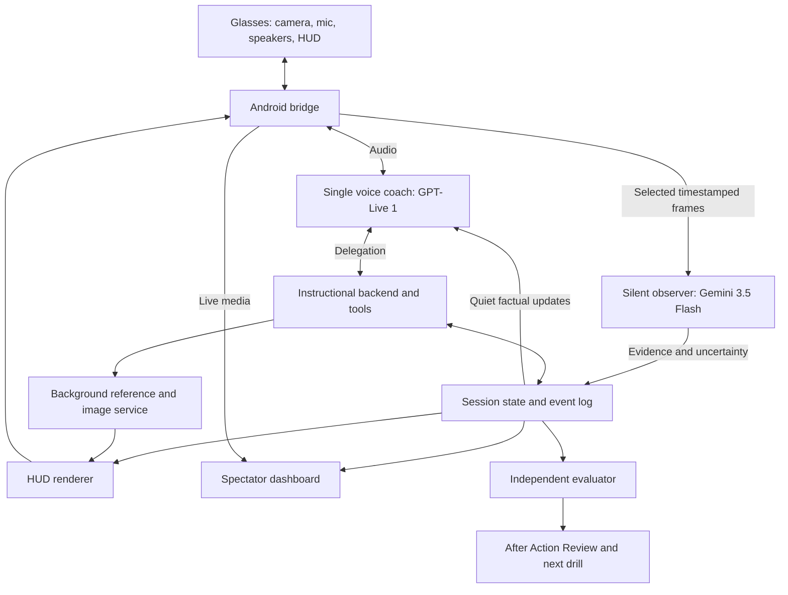

# Models and architecture for the first-person training coach

Research and access checks: September 15, 2026.

**Release-day update:** Google's newly published Gemini 3.8 Live documentation and deeper tests change the initial recommendation below. Start with the [Gemini 3.8 analysis](./gemini38/analysis.md); the earlier uncertainty about its availability and asynchronous tools is superseded.

## Recommendation

For the ambitious demo, test **GPT-Live 1 as the single speaking instructor, Gemini 3.5 Flash as a silent visual observer, and a separate evidence-based evaluator**. GPT-Live's full-duplex conversation and ability to receive quiet observer updates suit a learner who is working with both hands and thinking aloud. This is an architectural recommendation, not a measured claim that its voice is better.

Keep **Gemini 3.1 Flash Live** as the main comparison and the fastest path to a working prototype with the credentials already available. It can receive camera frames and audio in the same session. Compare **GPT-Realtime-2.1** if direct image input in the speaking model proves better than coordinating an observer.

For visuals, use reviewed reference figures and SVG/Canvas overlays first. Trial **Nano Banana 2 Lite** for generated supplementary illustrations. Add **GPT-Image-2.5 Flare** to the image comparison when a direct OpenAI key is available.

## What was actually checked

Both supplied keys authenticated successfully. Gemini's authenticated model list returned 58 entries; OpenRouter's catalog returned 446. The OpenRouter key was separately authenticated because its model list is public.

| Check | Observed result | What this establishes |
|---|---|---|
| Gemini 3.1 Flash Live | Setup succeeded; returned audio and the expected transcript; first audio chunk in 662 ms after sending text | A short text-to-audio turn works with this key |
| Gemini 3.8 Live | Setup succeeded; returned audio and expected transcript; first audio chunk in 823 ms | This listed model also responds; public documentation was not verified |
| Gemini 3.5 Flash | A 256-token output budget produced an unusable introductory fragment. Recheck with explicit schema, minimal thinking and 1,024-token budget returned JSON in 2,841 ms | Basic structured text reasoning works with appropriate configuration |
| GPT-5.6 Luna through OpenRouter | Returned JSON in 5,109 ms; provider reported $0.0001776 | OpenRouter inference works, including an OpenAI text model |
| GPT-Live 1 / GPT-Realtime-2.1 / Flare | Official documentation checked; no direct OpenAI key available | No hands-on access or performance claim |
| Nano Banana 2 Lite | Listed by Gemini and OpenRouter | Catalog availability only; image generation not tested |

The synthetic text test described an obscured strap on a foam prop and asked whether its tightness could be assessed without a force sensor. Both completed responses declined to assess tightness. This was **not an image-understanding test**. There were no microphone, camera, gesture, interruption, tool-use, sustained-session, or medical-competency evaluations. Timings are single observations, include network effects, and are not comparable latency benchmarks across modalities. Audio bytes were received but voice quality was not listened to or graded.

Raw sanitized results: [access-checks.json](./access-checks.json). Catalog snapshots: [Gemini](./gemini-models.json), [OpenRouter](./openrouter-models.json).

## Speech model comparison

| Candidate | Fit for this prototype | Main tradeoff | Recommendation |
|---|---|---|---|
| GPT-Live 1 | Full-duplex voice with backend delegation; accepts quiet context updates | No image/video input; observer coordination is required | First candidate for the ambitious experience |
| Gemini 3.1 Flash Live | Direct audio, image and video input; one multimodal conversation | Preview; tool calls block its response until results return | First working baseline with current keys |
| GPT-Realtime-2.1 | Speech-to-speech, image input, tools and configurable reasoning | Image frames rather than native video; extra reasoning can add latency | Strong third finalist |
| Original GPT-Realtime | Speech and image input | Older generation; dated snapshot is marked deprecated | Prefer testing 2.1 for a new build |
| Grok Voice + observer | Native speech-to-speech and tools; separate observer can feed context | No native visual input; another direct provider integration | Worth comparing if voice preference warrants it |
| Qwen3.5-Omni Plus/Flash Realtime | Audio/visual conversation and tools in current SDK documentation | Additional regional access/setup; no account test; documentation inconsistencies | Secondary candidate |
| MiniMax Speech 2.8 | Streaming, expressive TTS | Verified offering is speech synthesis, requiring separate ASR, reasoning and turn coordination | Use if a particular voice is essential |

Sources: [GPT-Live model](https://developers.openai.com/api/docs/models/gpt-live-1), [Gemini 3.1 Live](https://ai.google.dev/gemini-api/docs/models/gemini-3.1-flash-live-preview), [GPT-Realtime-2.1](https://developers.openai.com/api/docs/models/gpt-realtime-2.1), [original GPT-Realtime](https://developers.openai.com/api/docs/models/gpt-realtime), [Grok speech-to-speech](https://docs.x.ai/developers/models/speech-to-speech), [Qwen current SDK](https://docs.modelstudio.console.alibabacloud.com/en/model-studio/omni-realtime-python-sdk), [MiniMax API overview](https://platform.minimax.io/docs/api-reference/api-overview).

### Why GPT-Live is interesting here

The application can append factual observations through `session.thinking.append` without asking the instructor to read them aloud. It can use `session.commentary.append` for information intended for speech. Updates are limited to 500 tokens per event. An acknowledgment does not prove that the next spoken phrase incorporates the entire update, so this path needs testing for stale corrections. [Session context documentation](https://developers.openai.com/api/docs/guides/live-conversations).

Start with managed Responses delegation to an instructional backend such as GPT-5.6 Terra if its workflow fits. The observer can still send session-wide updates independently. Client delegation allows Gemini, OpenRouter or custom services behind the voice, but the application must reconstruct the request from transcripts and session state; the delegation event does not contain the actual task text. [Delegation documentation](https://developers.openai.com/api/docs/guides/live-delegation).

### Gemini implementation consequence

Keep tools quick: update a HUD card, retrieve a cached rubric passage, or enqueue a job and immediately return its job ID. Send later results as context. Do not make a synchronous tool wait for an image generator or an entire After Action Review. [Live tool behavior](https://ai.google.dev/gemini-api/docs/live-api/tools).

The account also exposes `gemini-3.8-live` and its extended-thinking variant. Their catalog metadata reuses a 3.1 version string. Successful audio generation does not resolve model lineage, pricing or feature compatibility; keep 3.8 experimental until documented and tested.

### Qwen and MiniMax distinctions

Qwen's current SDK and event references describe Qwen3.5-Omni Realtime tool support; another official overview says otherwise. Verify the chosen region/model in a real session. Tool use and built-in web search cannot be enabled together in the current SDK description. [Qwen Java SDK](https://docs.modelstudio.console.alibabacloud.com/en/model-studio/omni-realtime-java-sdk), [conflicting overview](https://www.alibabacloud.com/help/en/model-studio/s2s-model).

MiniMax's verified Speech 2.8 endpoints are text-to-speech. Streaming TTS alone does not supply listening, visual reasoning, interruption policy or training state. A composed ASR → LLM → TTS system can work, but adds integration work for this hackathon.

## Proposed architecture

This assumes the glasses/phone integration can deliver the required camera and display access; these API tests do not validate Meta hardware support or simultaneous native/web-app sessions.

### Responsibilities

- **Voice coach:** one consistent personality, brief prompts, learner interruptions and follow-up questions. It receives observed facts, current objectives and permitted coaching content.
- **Observer:** analyze selected frames or short sequences. Return frame IDs, timestamps, visible objects, observable actions, uncertainty and whether evidence is sufficient. Start by testing Gemini 3.5 Flash; its successful text request is not evidence of visual accuracy.
- **Instructional backend:** retrieve the relevant training passage, choose a hint, update the HUD and manage exercise progression. Use code for timers and state transitions. Avoid a deep reasoning call for every video frame or routine exchange.
- **Evaluator:** use a separate context containing the rubric, transcript, selected images and event log. Grade with evidence references. Reusing the backend model is acceptable; independence means it does not simply inherit the coach's verdict.
- **Shared session service:** owns authoritative state and broadcasts events to learner and spectator views. The dashboard's display must be derived from recorded events, not independently invented by another model.

Use a bounded frame queue and discard stale results. Begin with sparse sampling plus extra frames at task checkpoints; measure the complete camera-to-feedback delay before selecting the sampling rate. Maintain higher frame-rate spectator media independently of model sampling. A model receiving occasional frames cannot establish continuous physical technique.

An additional observer candidate is `gemini-robotics-er-2-streaming-preview`, listed in the account and described as a live vision-language endpoint. Its model page contains inconsistent capability-table text, so treat it as a targeted spatial-perception experiment, not the initial dependency. [Robotics streaming model page](https://ai.google.dev/gemini-api/docs/models/gemini-robotics-er-2-streaming-preview?hl=en).

### What this enables on stage

The learner picks up a training prop and begins. The observer identifies a visible event; the instructor asks a relevant question. When the learner blocks the view, it asks for a better angle rather than claiming success. The learner corrects an observable action, and the HUD updates. The After Action Review links its findings to those moments and launches a focused follow-up drill. This demonstrates perception, conversation and adaptation in one coherent sequence.

For medical practice, visible placement and sequence are different evidence from force, pressure or treatment effectiveness. The latter require appropriate trainer measurements or instructor confirmation. Training-specific content and rubrics should come from reviewed course material.

## Images and diagrams

| Option | Use | Access and limitation |
|---|---|---|
| Reviewed figures + SVG/Canvas | Exact labels, arrows, timers, checklists, highlighting on a captured frame | Immediate and deterministic; recommended HUD foundation |
| Nano Banana 2 Lite (`gemini-3.1-flash-lite-image`) | Simple supplementary concept illustrations | In both catalogs; Google advertises sub-2-second latency, not measured here; 1K output |
| Nano Banana 2 (`gemini-3.1-flash-image`) | More demanding compositions or higher-resolution spectator assets | In both catalogs; evaluate when Lite's quality is insufficient |
| GPT-Image-2.5 Flare | Fast generation/editing comparison with Lite | Officially documented; not in the retrieved OpenRouter catalog; direct OpenAI access not tested |

Sources: [Lite capabilities](https://ai.google.dev/gemini-api/docs/models/gemini-3.1-flash-lite-image), [Google image model selection](https://ai.google.dev/gemini-api/docs/image-generation), [Flare](https://developers.openai.com/api/docs/models/gpt-image-2.5-flare).

Generate visuals asynchronously and cache them. For procedural medical instruction, retrieve reviewed figures rather than generating novel anatomical or placement instructions during the performance. Generated images can support conceptual explanation or the post-session review. Arrows on a camera image do not establish a calibrated, world-anchored overlay in the glasses.

## Pricing implications

These are documented list rates, not a full-session quote:

- GPT-Live 1: **$0.05 per session minute**, billed per second, plus backend models/tools. A five-minute session is $0.25 for the voice session component. [Model pricing](https://developers.openai.com/api/docs/models/gpt-live-1).
- Gemini 3.1 Live: **$3/M audio input tokens and $12/M audio output tokens**. Text, video, transcription and retained context also matter. Historical context is billed again on subsequent turns, so advertised audio-minute equivalents are not an all-in flat session price. Configure context compression. [Pricing](https://ai.google.dev/gemini-api/docs/pricing), [billing behavior](https://ai.google.dev/gemini-api/docs/live-api/best-practices#pricing-and-billing).
- GPT-Realtime-2.1: **$32/M audio input and $64/M audio output tokens**, plus other modalities; mini is a lower-cost alternative to test. [Model pricing](https://developers.openai.com/api/docs/models/gpt-realtime-2.1).
- Current Grok speech-to-speech: **$0.08 per minute of audio sent or received**, plus **$0.004 per text input event**, with specified exceptions. Frequent unsolicited observer updates can add cost: one billable text event each second is $0.24/min before voice and observer inference. Send meaningful state changes. [Billing rules](https://docs.x.ai/developers/models/speech-to-speech).
- Nano Banana 2 Lite: approximately **$0.0336 per 1K output image**, plus input/text charges. [Google pricing](https://ai.google.dev/gemini-api/docs/pricing).
- Flare: **$30/M image output tokens**, with text/image input charges; cost varies with generation settings. Equal token prices across vendors do not imply equal per-image cost. [Flare pricing](https://developers.openai.com/api/docs/models/gpt-image-2.5-flare).

Use direct Gemini/OpenAI connections for the live voice paths. The retrieved OpenRouter catalog contained no live, realtime or Flare IDs. Its documented file-audio and streaming TTS APIs should not be mistaken for a provider's bidirectional live session API. OpenRouter remains useful for swapping ordinary observer/evaluator models. [OpenRouter multimodal overview](https://openrouter.ai/docs/guides/overview/multimodal/overview).

## How to choose the winner

Run the same short physical task with GPT-Live + observer, Gemini Live and GPT-Realtime-2.1. Use identical rubric content, props, audio routing and network conditions. Repeat enough times to measure median and slow-tail performance.

1. Measure end-of-utterance to first audible response, including the glasses audio path.
2. Interrupt mid-sentence and measure how quickly playback actually stops.
3. Change the physical scene without naming the change; measure relevant feedback latency and accuracy.
4. Obscure the camera and test whether the coach acknowledges missing evidence.
5. Correct an earlier action and test for stale observer feedback.
6. Run a slow image job while continuing the conversation.
7. Check tool execution, synchronized HUD/spectator state and reconnect recovery.
8. Audit the evaluator's evidence citations and whether its next drill targets an observed weakness.

Suggested selection weighting: visual grounding and uncertainty 30%, natural conversation and interruption 25%, latency and reliability 25%, coaching/rubric adherence 15%, cost 5%. These are design priorities for this demo, not published benchmarks.

**Decision:** favor GPT-Live + observer if the integrated experience wins those tests. Favor Gemini Live if direct audio/visual context is materially more reliable or faster. A direct OpenAI project key is the missing prerequisite for the hands-on GPT-Live, Realtime and Flare comparison; it can be added as `OPENAI_API_KEY` in the local `.env`.
